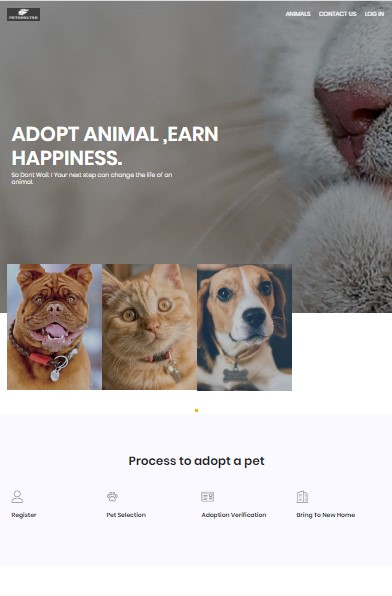
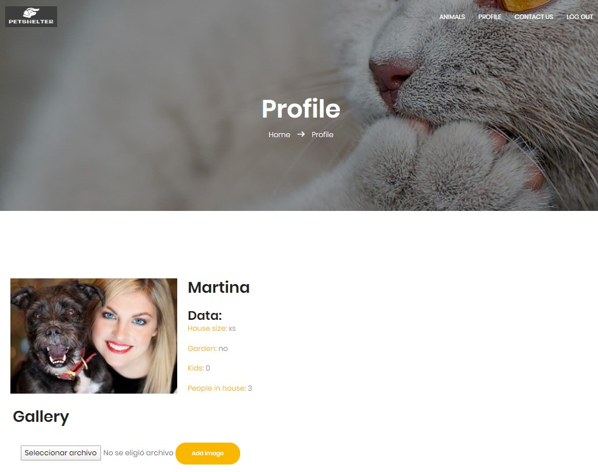
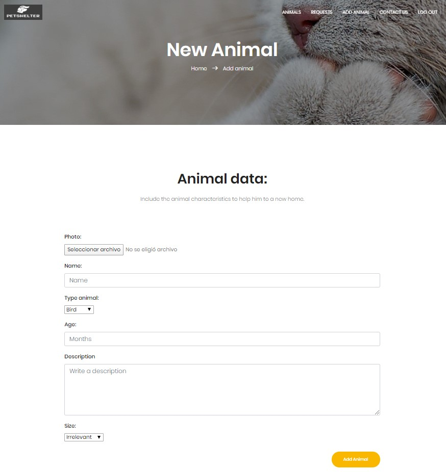
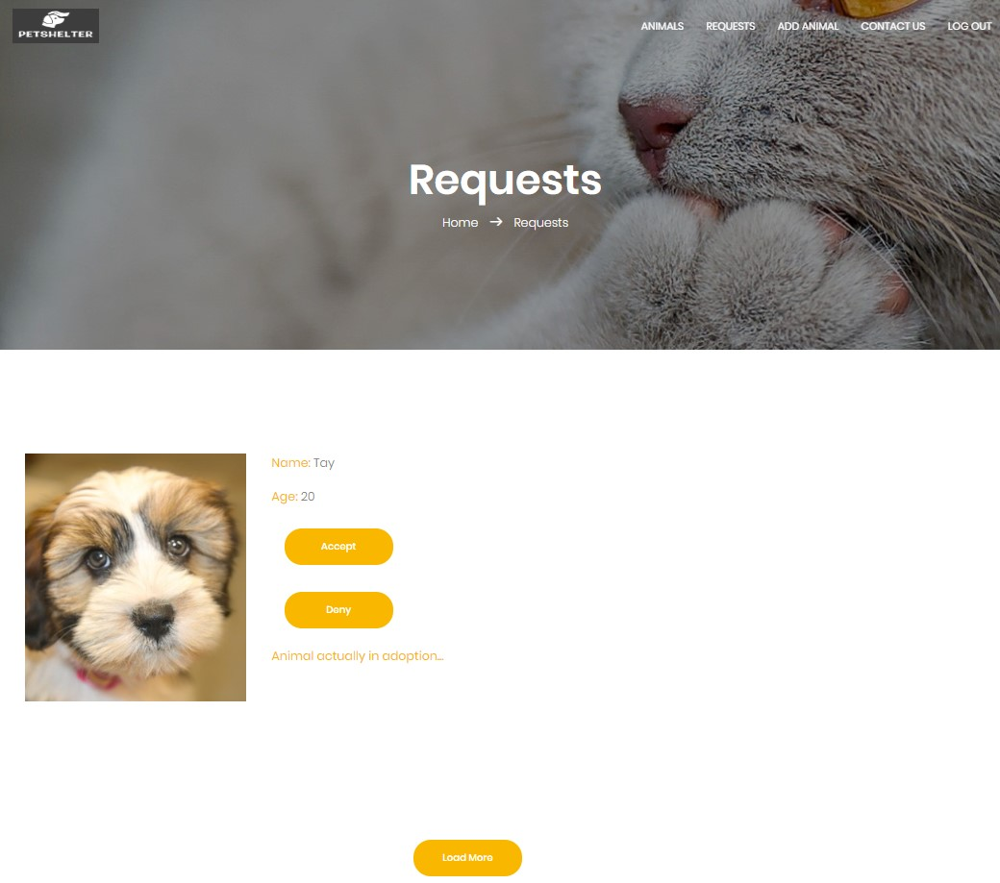
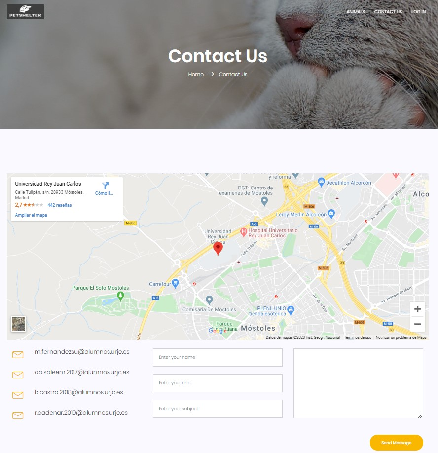
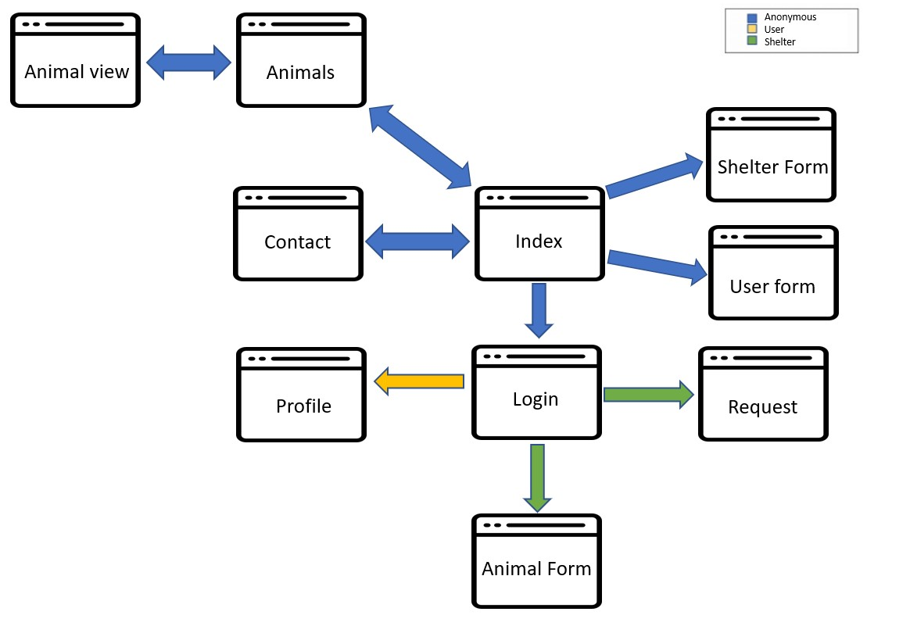

 # PETSHELTER 
It’s a web application on animal adoption. Animal shelters and dog pounds can upload their animals data for users to adopt them, and in conclussion for letting users see elegible pets for adoption.

## Members of group

| NAME  | UNIVERSITY MAIL | GITHUB ACCOUNT |
|  ------------- |------------- | ------------- |
| Arshia Ambar  Saleem    | aa.saleem.2017@alumnos.urjc.es  | ArshiaSaleem98  |
| Borja  Castro Cruces  | b.castro.2018@alumnos.urjc.es  | borja123456  |
| Marina Fernández Suárez   | m.fernandezsu@alumnos.urjc.es  | IhoFenixMFS  |
| Rodrigo  Cadena Rodríguez  | r.cadenar.2019@alumnos.urjc.es  | CadenaR  |

## Used Tools 
#### Trello
[Link to our board.](https://trello.com/b/ZzIXGZ6A/aplicaciones-web)

## Entities:
### User:
>Registered users can request the adoption of any animal that the search shows them. In addition, they can upload images to their profiles.
* Attributes:
  * Photo.
  * Name.
  * DNI.
  * Adress.
  * House size (Big/Medium/Little).
  * Garden (No/Little/Medium/Big).
  * Children number.
  * People living in the house.
  * E-mail.
  * Password.
  * Galery.

### Animals:
>The available animals list would be visible, here will appear an image of the animal, his/her name, the age, the owner and if it has been already adopted or not.
* Attributes:
  * Photo.
  * Name.
  * Age.
  * Animal type (Dog/Cat/Bird/Reptile/Equine).
  * Size (XL/Big/Medium/Little).
  * Description.
  * Owner.
  * Status (Adopted or not).

### Shelter:
>The shelter can upload animals for them to get adopted, and accept or deny user adoption requests.
* Attributes:
  * Name.
  * NIF.
  * E-mail.
  * Password.
  * Average Rating.
  * Description.
  * Address.
  * Animal list.
  * Adoption Requests Received (Animal/User).

### Adoptions:
>In order to have a register of the adoptions made by the users an adption table is needed.
* Attributes:
  * Date.
  * Animal ID.
  * User ID.
  
## Users permissions:
### *Anonimous*
Anonymously or through any user type it is possible to access *Home*, the animal list *Animals* and the animal profile, the shelter or users profile, and *Contact Us*.
### *User*
This user type can request adoptions, edit his/her profile data, and upload images to his/her gallery.
### *Shelter*
This user type can edit its profile data, accept or deny its adoption requests, and upload new animals to the platform.

## Images:
Registered users and animals have their profile image which can be edited and updated by them or their shelter in case that is an animal profile. In addition, users have an image gallery associated in which they can upload all the pictures they want.

## Graphs:
The adoption statistics are going to be shown through a diagram in the graph view.

## Complementary Technology:
When a user requests an adoption, an e-mail will be sent to the proprietary shelter.

## Advanced Query or Algorithm:
The shown animal list will filter available animals and change depending on the house size of the user navigating through the web. For example, a big dog wouldn’t appear in the list of a small house owner.

## Screenshots

###### This is the initial page, wher all users are going to be address when opening our web App, it has a header and footer that is shared with all the other pages and also the graph with adoption statistics is going to be shown.

###### This page is going to show all the images of the animals that have been registered over time.

###### In this page the user is going to see the profile of the animal that he wants to adopt.

###### This page is going to show user's profile.

###### This is where users can log in.

###### This page is to be shown when an error occurs.

###### This page is for registering a new animal to adopt.

###### This image shows how the request is going to look.

###### This page is to register a new user.

###### This page is to register a new shelter.

###### This is the page is for the users of the Web App to get in contact with us.

## Navigation Diagram

###### This diagram shows how the navigation in our aplication is intended to be.

###### This diagram shows the differents templates, controller and services used in the web server

## Entity Diagram

###### This diagram shows entities with thier fields and relationship of them with Database.
## PARTICIPATION PHASE 2

### Borja Castro Cruces
- Custom Error Page and CustomError Controller
- Algorithm for search by userSizeHouse and userGarden and match with the best animal for him
- ModelAttributeController
- Class and Template Diagrams

### Arshia Ambar Saleem
- Add Animals to adopt
- Show Animal into animal page
- Pagination
- Graph
- Entity Diagram
- Filter Animal (search by type, search by name)

### Marina Fernandez
- Adoption finished implementation
- Animal Carusel implemented and animal profile revision
- User Profile finished with gallery implemented
- Mailing implementation
- Entity relations implemented

### Rodrigo Cadena
- User creation
- CSRF implementation
- Security BCrypt configuration
- https on port 8443
- Session scope component to save logged user/shelter
# PHASE 3
Developing the API REST and Dockerization of the application
[More detailed information](https://github.com/CodeURJC-DAW-2019-20/webapp11/blob/master/API.md)
## PARTICIPATION PHASE 3
### Arshia Ambar Saleem
I have contributed in creating Api rest url to get and post animal, user's profile and user's gallery images.Moreover, i have done Api Rest for Pagination and contributed in creating user's gallery service .
#### Commits:
- [Api rest url created to get and post animal Image](https://github.com/CodeURJC-DAW-2019-20/webapp11/commit/08ac821722e6f2d837d039555929095ec8900f07)

- [Api rest url created to get and post User Image](https://github.com/CodeURJC-DAW-2019-20/webapp11/commit/ac53638d3823c3bba8967ce910b9600e160ca6d5)

- [Api rest url created to get and post User's gallery](https://github.com/CodeURJC-DAW-2019-20/webapp11/commit/0689fef511052f010439a0abcc50a04e059d11ab)

- [Api Rest Pagination](https://github.com/CodeURJC-DAW-2019-20/webapp11/commit/537535bff50369f34ea88e7c183a5f6deddfec9e)
- [User gallery service created](https://github.com/CodeURJC-DAW-2019-20/webapp11/commit/537535bff50369f34ea88e7c183a5f6deddfec9e)
#### Files:
- [APIanimalController.java](https://github.com/CodeURJC-DAW-2019-20/webapp11/blob/master/backend/animalshelter/src/main/java/es/sidelab/animalshelter/api/APIanimalController.java)

- [APIusergalleryphotoController.java](https://github.com/CodeURJC-DAW-2019-20/webapp11/blob/master/backend/animalshelter/src/main/java/es/sidelab/animalshelter/api/APIusergalleryphotoController.java)

- [APIWebUserController.java](https://github.com/CodeURJC-DAW-2019-20/webapp11/blob/master/backend/animalshelter/src/main/java/es/sidelab/animalshelter/api/APIWebUserController.java)

- [UserGalleryService.java](https://github.com/CodeURJC-DAW-2019-20/webapp11/blob/master/backend/animalshelter/src/main/java/es/sidelab/animalshelter/services/UserGalleryService.java)
### Borja Castro Cruces
I create the instructions to use docker(creatin the DockerFile of the application) and modify the applications properties to use docker easy. I have done the classes diagram of the current proyect.
#### Commits:
 - [ Creation of DockerFile](https://github.com/CodeURJC-DAW-2019-20/webapp11/commit/d096946935871a256e8aaca2e6325e53b382af9c)
 - [Creation of Script  for run the app in docker with Windows(without docker-compose)](https://github.com/CodeURJC-DAW-2019-20/webapp11/commit/d096946935871a256e8aaca2e6325e53b382af9c)
 - [Classes diagram](https://github.com/CodeURJC-DAW-2019-20/webapp11/commit/5f2c7d72a018b31fbcce88694d14aad1eab55bb7)
 - [Creation of API.md](https://github.com/CodeURJC-DAW-2019-20/webapp11/commit/fe695e161a45c9cb69bc131a70112682bdfc189f)
 - [Modifications of applications properties for docker](https://github.com/CodeURJC-DAW-2019-20/webapp11/commit/d096946935871a256e8aaca2e6325e53b382af9c)
 
#### Files:
- [DockerFile](https://github.com/CodeURJC-DAW-2019-20/webapp11/blob/master/docker/Dockerfile)
- [API.md](https://github.com/CodeURJC-DAW-2019-20/webapp11/blob/master/API.md)
- [create_image.bat](https://github.com/CodeURJC-DAW-2019-20/webapp11/commit/7a118c6a8f4584f3cda0cdd638cefd4a46ed584e)
- [ Diagram v.3.png](https://github.com/CodeURJC-DAW-2019-20/webapp11/blob/master/ReadmeImgs/Diagram%20v.3.png)
- [application.properties](https://github.com/CodeURJC-DAW-2019-20/webapp11/commit/d096946935871a256e8aaca2e6325e53b382af9c)
### Marina Fernandez
I mainly initialized the workflow again for the API creating the templates for the team, I did collaborate with the services and controllers for the API REST and dockerized the application.
#### Commits:
- [Docker final implementation script fixed and working](https://github.com/CodeURJC-DAW-2019-20/webapp11/commit/7ba1f6c29eae6f40940cc40bed93a46e278189df)
- [Docker finished script revision](https://github.com/CodeURJC-DAW-2019-20/webapp11/commit/3da876c5f8a58a57e6269449e9367002cb1f2da6)
- [Animal and Adoption Services implemented ready for API](https://github.com/CodeURJC-DAW-2019-20/webapp11/commit/c6b3df80fe6d018f5823fbd6547e4778f2b5b6d2)
- [API REST first part implementation finished](https://github.com/CodeURJC-DAW-2019-20/webapp11/commit/dc6d64c0a1f9b8ee4912ef459b9c5863ccffe1a0)
- [API REST implementation started and finished adoptions API](https://github.com/CodeURJC-DAW-2019-20/webapp11/commit/f66436d226282edb9891b5136e4bd5a846840c09)
#### Files:
- [docker-compose.yml](https://github.com/CodeURJC-DAW-2019-20/webapp11/blob/master/docker/docker-compose.yml)
- [APIanimalController.java](https://github.com/CodeURJC-DAW-2019-20/webapp11/blob/master/backend/animalshelter/src/main/java/es/sidelab/animalshelter/api/APIanimalController.java)
- [AdoptionService.java](https://github.com/CodeURJC-DAW-2019-20/webapp11/blob/master/backend/animalshelter/src/main/java/es/sidelab/animalshelter/services/AdoptionService.java)
- [AnimalService.java](https://github.com/CodeURJC-DAW-2019-20/webapp11/blob/master/backend/animalshelter/src/main/java/es/sidelab/animalshelter/services/AnimalService.java)
- [APIusergalleryphotoController.java](https://github.com/CodeURJC-DAW-2019-20/webapp11/blob/master/backend/animalshelter/src/main/java/es/sidelab/animalshelter/api/APIusergalleryphotoController.java)

### Rodrigo Cadena
I have participated in the completion of the rest controllers, created services that share similar functions and the security configuration for the API requests.

#### Commits:
- [Adaptation for web user controller and rest controller](https://github.com/CodeURJC-DAW-2019-20/webapp11/commit/6d6d3855ddbfcf5ea9a4de8cb5abbddc47b501ae)
- [Rest security configuration](https://github.com/CodeURJC-DAW-2019-20/webapp11/commit/a8e4b03da595ffc9f8ea6454d232f08ab8882eb0)

- [Login controller for API](https://github.com/CodeURJC-DAW-2019-20/webapp11/commit/3cccbeed8cb552ffdaf006800145cb70269308e3)

- [animal service adapted for controller and rest controller](https://github.com/CodeURJC-DAW-2019-20/webapp11/commit/dc4a9634184c73093ec371db0d7d13a4e8413950)

- [Statistics rest controller for graph](https://github.com/CodeURJC-DAW-2019-20/webapp11/commit/8c751450884fe8a06334e548b4d3fd010078b22b)
#### Files:
- [ShelterService.java](https://github.com/CodeURJC-DAW-2019-20/webapp11/blob/master/backend/animalshelter/src/main/java/es/sidelab/animalshelter/services/ShelterService.java)

- [WebUserService.java](https://github.com/CodeURJC-DAW-2019-20/webapp11/blob/master/backend/animalshelter/src/main/java/es/sidelab/animalshelter/services/WebUserService.java)

- [RestSecurityConfig.java](https://github.com/CodeURJC-DAW-2019-20/webapp11/blob/master/backend/animalshelter/src/main/java/es/sidelab/animalshelter/api/RestSecurityConfig.java)

- [APIshelterController.java](https://github.com/CodeURJC-DAW-2019-20/webapp11/blob/master/backend/animalshelter/src/main/java/es/sidelab/animalshelter/api/APIshelterController.java)

- [LoginController.java](https://github.com/CodeURJC-DAW-2019-20/webapp11/blob/master/backend/animalshelter/src/main/java/es/sidelab/animalshelter/api/LoginController.java)
# Classes diagram

###### This diagram shows the differents templates, controller and services used in the web server
# PHASE 4
## PARTICIPATION PHASE 4
#### Commits:
### Arshia Ambar Saleem
I have worked on creating animals and show their information, along with i have also done filter search where a user can search animals by their names or by their type .I have done the task of creating gallery for user and show user's detail with gallery.Moreover, i have done the part of paging on both animals and user's gallery page.

- [animalform component and html created](https://github.com/CodeURJC-DAW-2019-20/webapp11/commit/9fb6f0114d1c4d6cddfc78395fb081c22779f5df)

- [Done part of show animal details ,Search animal by Type and Search by Name](https://github.com/CodeURJC-DAW-2019-20/webapp11/commit/a838f2d2e873ff2ed2d7fcec6299a474644d79c6)

- [Pagination done in animal page](https://github.com/CodeURJC-DAW-2019-20/webapp11/commit/303a58b8ff995162a1d8d2ad9c38030b4d813e47)

- [user's gallery created and done showing gallery in user's profile](https://github.com/CodeURJC-DAW-2019-20/webapp11/commit/83fff6a20fce635e12101f5f0ea963e8c3a7950b)

- [Pagination done in users's Gallery](https://github.com/CodeURJC-DAW-2019-20/webapp11/commit/2363660d7faf8a60fdc234cacee0f7a860cd7ea5)

#### Files:
- [animalform](https://github.com/CodeURJC-DAW-2019-20/webapp11/tree/master/AngularAnimalShelter/src/app/components/animalform)

- [animals](https://github.com/CodeURJC-DAW-2019-20/webapp11/tree/master/AngularAnimalShelter/src/app/components/animals)

- [profile](https://github.com/CodeURJC-DAW-2019-20/webapp11/tree/master/AngularAnimalShelter/src/app/components/profile)

- [animalview](https://github.com/CodeURJC-DAW-2019-20/webapp11/tree/master/AngularAnimalShelter/src/app/components/animalview)

### Borja Castro Cruces
### Marina Fernandez
### Rodrigo Cadena

